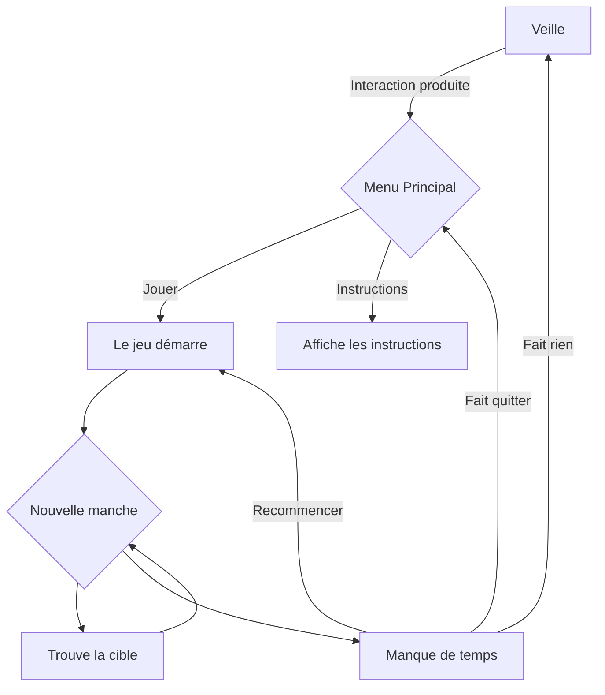
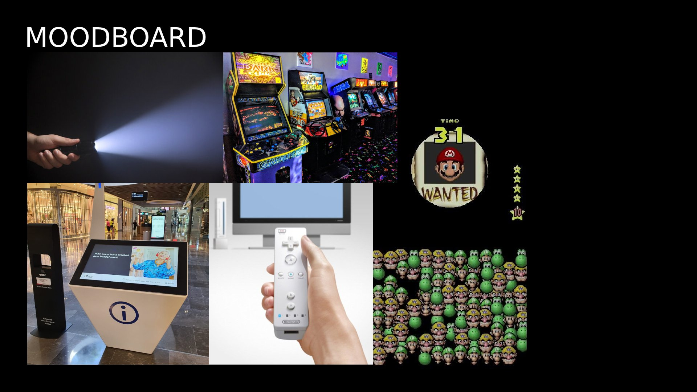

# Scénarisation
## Idée
### Concept
Utiliser une lampe de torche pour trouver des éléments recherchés et cachés sur un écran dans le temps attribué.

### Objectifs
Faire que les actions dans le vrai monde (dans ce cas, où la lampe de torche pointe) impacte un jeu virtuel.

## Scénario

## Ambiance
Moodboard

## Technologies
- Lampe de torche non-fonctionnelle
- Capteur infrarouge (1 ou plus, pas encore certain)
- Projecteur d'infrarouge
- Gros Écran 16/9
- Écran 4/3 ou 1/1
- Fil d'alimentation (4x)
- Batterie rechargeable
- Display (similair à des cabines d'arcades) pour monter l'oeuvre (1 pour chaque écran (2x))
- Prise électrique (4x)
- Ordinateur Portable

### Logiciels
- Unity
- Visual Studio Community 2022
- Arduino

### Logiciels pour la création de médias
- Maya
- Photoshop
