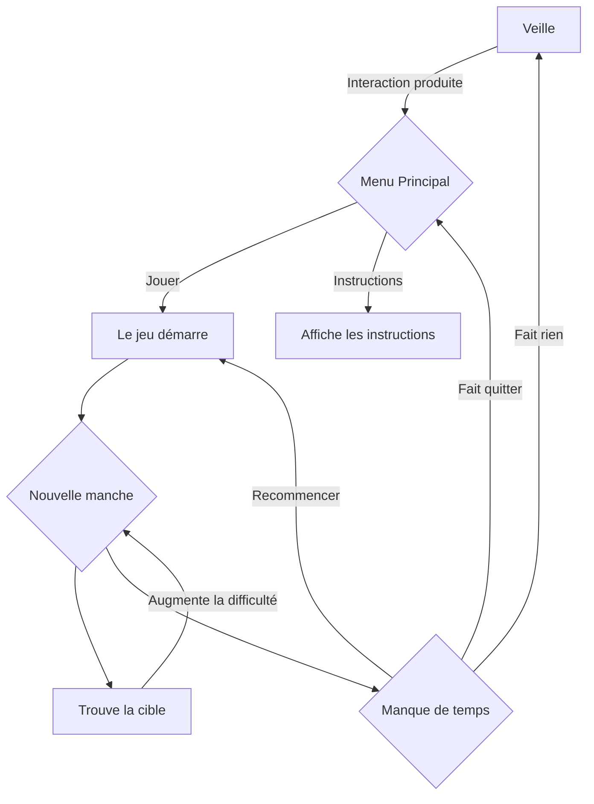

# Projet: Recherche Nocturne
## Idée
### Concept
Utiliser une lampe de torche pour trouver des éléments recherchés et cachés sur un écran dans le temps attribué.

### Objectifs
Faire que les actions dans le vrai monde (dans ce cas, où la lampe de torche pointe) impacte un jeu virtuel.

## Scénario

## Ambiance
### Moodboard

### Lampe de torche
Ceci serait la manette qui contrôle le jeu. Il suffit de la pointer vers l'écran et appuyer sur le bouton dessus pour jouer.

### Machine d'arcade
Les machines d'arcade représentent un peu plus comment que l'oeuvre va être visuellement installé pour faire comprendre à l'utilisateur que ce jeu est un peu comme un jeu d'arcade.

### Écran de dispositif
Cet écran, si le budget nous laisse, serait un deuxième écran qui servirait à montrer la cible à trouver, combien de temps il reste pour la trouver et le score présent.

### Wii Remote
La manette Wii sert de représentation visuelle de comment la lampe de torche fonctionnera et sera utilisée, avec un capteur infrarouge pour détecter l'endroit que le joueur pointe vers.

### Mini-jeu Wanted de *Super Mario 64 DS*
Ce mini-jeu est une inspiration majeure pour la base de ce projet. Ce mini-jeu consiste à trouver un personnage de la série Super Mario caché parmi les autres avant que le temps s'écoule.

## Technologies
- Lampe de torche non-fonctionnelle
- Capteur infrarouge (1 ou plus, pas encore certain)
- Projecteur d'infrarouge
- Gros Écran 16/9
- Écran 4/3 ou 1/1
- Fil d'alimentation (4x)
- Batterie rechargeable
- Display (similair à des cabines d'arcades) pour monter l'oeuvre (1 pour chaque écran (2x))
- Prise électrique (4x)
- Ordinateur Portable

### Logiciels
- Unity
- Visual Studio Community 2022
- Arduino

### Logiciels pour la création de médias
- Maya
- Photoshop
