# Flow Chart

```mermaid
flowchart TD
    A[Veille] -->|Interaction produite| B{Menu Principal}
    B -->|Jouer| D[Le jeu démarre]
    B -->|Instructions| E[Affiche les instructions]
    D --> F{Nouvelle manche}
    F --> G[Trouve la cible]
    F --> H[Manque de temps]
    G --> F
    H -->|Fait quitter| B
    H -->|Fait rien| A
    H -->|Recommencer| D
```

## Responsables
### Réalisé par: Sabrina Ratté

### Conception sonore fait par: Roger Tellier Craig

### Integration multimédia fait par: Guillaume Arseneault

## Dates

## Lieux

## Description d'Inflorescence

## Fonctionnement 

## Avis Personnel

